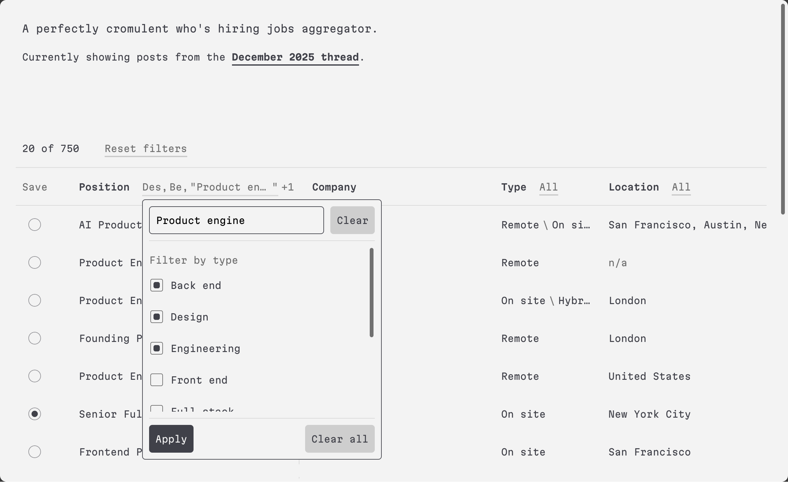

# A perfectly cromulent jobs aggregator

An aggregator for the monthly "Who's Hiring" thread on HackewNews. See it live at [cromulentjobs.com](https://www.cromulentjobs.com/)  

Run `npm run fetch <url>` to get posts from the hackernews api. 

To get the posts You can add an OpenAI key to the `.env` file, and run `npm run parse-threads <filename>` to have ChatGPT run through the saved posts and create the file for you. Or you can pass the file directly to ChatGPT (or similar) with the instructions in  
[scripts/parsingInstructions.ts](scripts/parsingInstructions.ts)  
and add the result to  
[src/data/jobData.ts](src/data/jobData.ts)
